# Using Document Filters with AWS Lambda

With this guide, you will set up an *AWS Lambda* function featuring Document Filters. This function will monitor S3 buckets and automatically convert newly uploaded *`*.docx`* files to *`*.pdf`*, saving the result in a different S3 bucket.
You will debug and deploy the Lambda Function via *Visual Studio*.

## Prerequisites:

 - Have this repository downloaded and unpacked.
 - Have *[Docker](https://www.docker.com/get-started/)* installed and working.
 - Have *[Visual Studio 2022](https://visualstudio.microsoft.com/vs/)* installed and working.
 - Have *AWS Toolkit with Amazon Q* extension for Visual Studio installed.
 - Have [AWS Access Portal URL](https://docs.aws.amazon.com/singlesignon/latest/userguide/using-the-portal.html) established. Refer to the following guides:
   - [Signing to the AWS Access Portal](https://docs.aws.amazon.com/singlesignon/latest/userguide/get-started-sign-in-access-portal.html)
   - [Customizing the AWS access portal URL](https://docs.aws.amazon.com/singlesignon/latest/userguide/howtochangeURL.html)

## Foreword:

This guide will operate on certain values, some of which may need to be different in your case. These values are constant throughout this guide and will be <font color="red"> marked red</font>. If you use alternate values, ensure you use your updated value as you progress through this guide.

 - AWS Region: Northern Virginia, <font color="red">*us-east-1*</font>
 - AWS access portal URL: <font color="blue">*must be established as a prerequisite*</font>
 - Bucket names: <font color="red">*docfilters-s3-tutorial*</font> and <font color="red">*docfilters-s3-tutorial-pdf*</font>
 - Converted file: <font color="red">*benchmark.docx*</font>
 - Policy name: <font color="red">*docfilters-s3-policy*</font>
 - Role name: <font color="red">*docfilters-s3-role*</font>
 - User name: <font color="red">*docfilters-s3-user*</font>
 - Repository name: <font color="red">*docfilters-s3-repository*</font>
 - Lambda name: <font color="red">*docfilters-s3-lambda*</font>

During each step and action, **pay attention to what region you are connected to.** All elements need to be created in the same region to work properly.

Some actions require elevated AWS user access; this will be noted under applicable steps.

A list of all AWS service consoles can be found [here](https://console.aws.amazon.com/console/services).

## Steps done on AWS site

### 1. S3 Buckets and Document Upload

_This step can be done with `PowerUser` access._

In this step, you will create two virtual storage objects (buckets) that will serve as input and output folders for the *AWS Lambda* function.


 - [Open the *Amazon S3* console.](https://console.aws.amazon.com/s3).
 - Create a general-purpose S3 bucket named <font color="red">*docfilters-s3-tutorial*</font>. This bucket will be a source container.
 - Click on the newly created bucket and upload a <font color="red">*benchmark.docx*</font> test file.

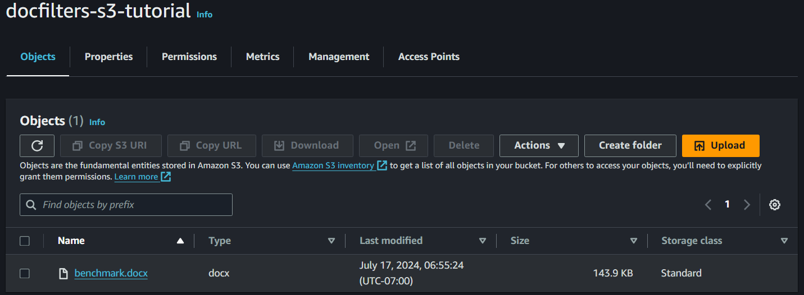

 - Create another general-purpose S3 bucket. Name it <font color="red">*docfilters-s3-tutorial-pdf*</font>. Converted files will be placed here.

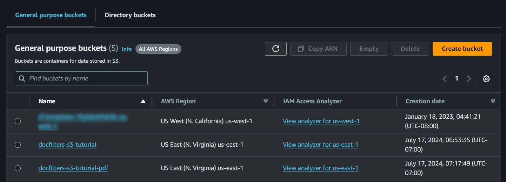

### 2. IAM Policies

_This step can only be done with `Administrator` Access._

In this step you will create authorization IAM policies that will be later assigned to IAM roles.

 - [Open the *Amazon IAM Policies* console.](https://console.aws.amazon.com/iam/home/#/policies)
 - Choose *`Create Policy`*.
 - Choose JSON tab, and paste the following policy. **Notice that in two cases, the bucket name under the `Resource` key matches the name of the bucket created in step 1**.
```
{
    "Version": "2012-10-17",
    "Statement": [
        {
            "Effect": "Allow",
            "Action": [
                "logs:PutLogEvents",
                "logs:CreateLogGroup",
                "logs:CreateLogStream"
            ],
            "Resource": "arn:aws:logs:*:*:*"
        },
        {
            "Effect": "Allow",
            "Action": [
                "s3:GetObject"
            ],
            "Resource": "arn:aws:s3:::docfilters-s3-tutorial/*"
        },
        {
            "Effect": "Allow",
            "Action": [
                "s3:PutObject"
            ],
            "Resource": "arn:aws:s3:::docfilters-s3-tutorial-pdf/*"
        }
    ]
}
```
 - Choose *`Next`*, then under policy name enter <font color="red">*docfilters-s3-policy*</font>.
 - Finish policy creation.

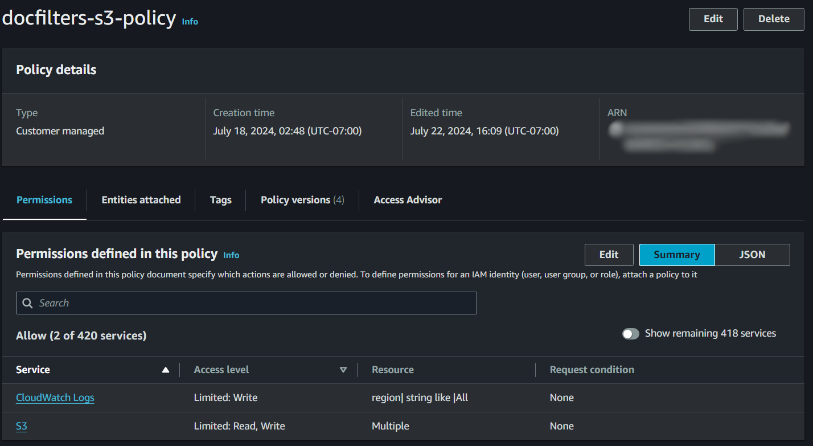

### 3. IAM Roles

_This step can only be done with `Administrator` Access._

In this step you will create IAM roles that determine permissions, as per policies assigned to them. Roles will be given later to *AWS Lambda* functions.

 - [Open the *Amazon IAM Roles* console](https://console.aws.amazon.com/iam/home/#/roles).
 - Choose *`Create Role`*.
 - Choose *`AWS Service`* as *`Trusted entity type`*.
 - Choose *`Lambda`* as *`Use case`*.
 - Choose *`Next`*, then find <font color="red">*docfilters-s3-policy*</font> policy created in previous step. Add it to the role.
 - Choose *`Next`*, name the role <font color="red">*docfilters-s3-role*</font>, finalize the creation process.
 
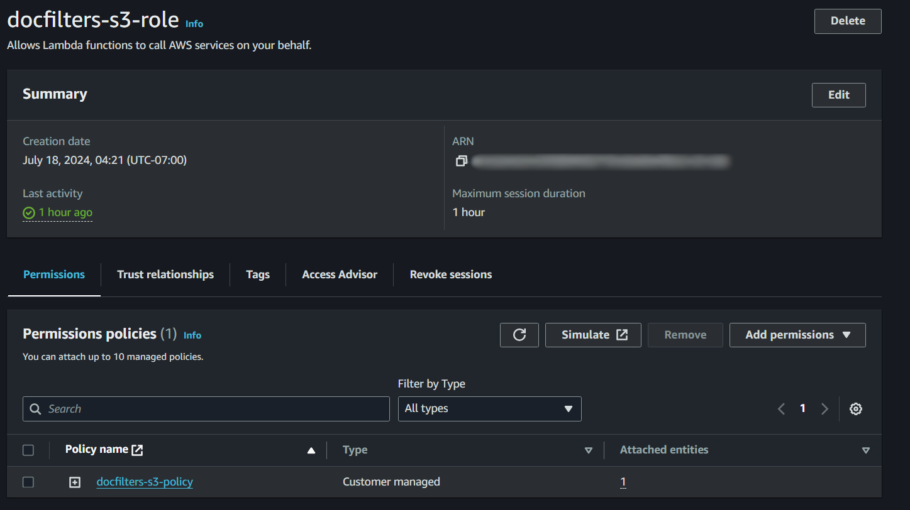

### 4. IAM User and Access key

_This step can only be done with `Administrator` Access._

In this step you will create a profile that grants long-term credentials to AWS. You will also create an access key that will be used to authenticate Visual Studio connection, required later to dynamically upload AWS Lambda functions.

 - [Open the Amazon IAM Users console](https://console.aws.amazon.com/iam/home/#/users).
 - Choose *`Create User`*.
 - Name user <font color="red">*docfilters-s3-user*</font>.
 - Choose *`Attach policies directly`* as *`Permission options`*.
 - Find *`PowerUserAccess`* in *`Permission policies`*. Attach it to the user and finalize the creation process.
 - Find and choose your newly created user in the user list. 
 - Choose *`Create access key`*.
 - Choose *`Command Line Interface (CLI)`* as a *`Use Case`*.
 - Mark the checkbox, confirming a creation of an access key.
 - Enter *`Dev Environment`* as a *`Description tag`*.
 - Download the _*.csv_ file before finalizing the access key creation.

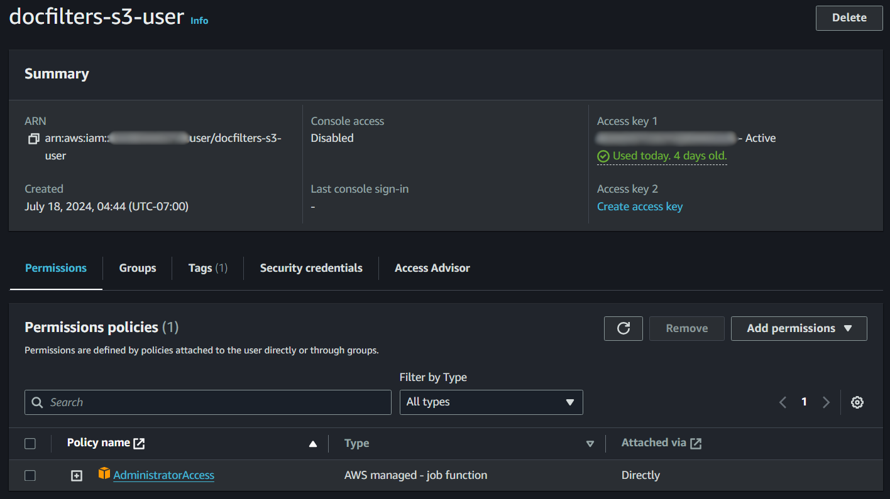

### 5. ECR Repository

_This step can be done with `PowerUser` access._

In this step, you will create a repository in dedicated ECR space. Docker images containing Lambda function will be stored there.

 - [Open the *Amazon Elastic Container Registry* console](https://console.aws.amazon.com/ecr).
 - Choose *`Create repository`*.
 - Choose *`private`* as repository settings.
 - Enter <font color="red">*docfilters-s3-repository*</font> as a repository name.
 - Choose *`Create repository`* to finalize the creation process.
 
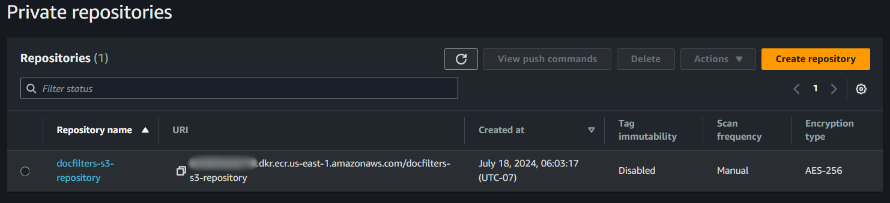

## Steps done locally

### 6. Install AWS tools

 - Using command prompt, install dotnet AWS templates

```
dotnet new install Amazon.Lambda.Templates
```

 - Using command prompt, install dotnet AWS tools

```
dotnet tool install -g Amazon.Lambda.Tools
```

 - Download and install [AWS CLI v2](https://docs.aws.amazon.com/cli/latest/userguide/cli-chap-install.html). Restart your computer. 

### 7. Creating default AWS SSO profile.

In this step, you will create a basic, default SSO profile that is required for correct connection between the local debugger and AWS.

 - Open powershell and enter aws configuration tool.

```
aws configure sso
```

 - Enter *`default`* as SSO session name.
 - Enter your<font color="blue"> AWS Access Portal URL</font> as SSO start URL.
 - Enter <font color="red">*us-east-1*</font> as SSO region.
 - Leave SSO registration scopes blank.
 - New browser card should pop up. Confirm authorization request.
 - Back in powershell, select appropriate AWS account. 
 - Select appropriate role (preferably *`AWSPowerUserAccess`*).
 - Enter <font color="red">*us-east-1*</font> as CLI default client Region.
 - Leave CLI default output format blank.
 - Enter *`default`* as CLI profile name.

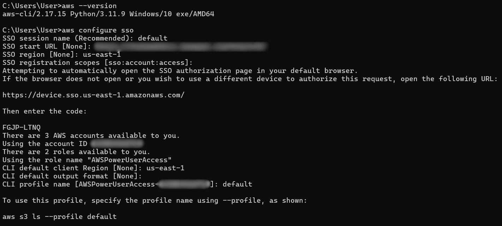

### 8. Authenticate AWS Tool in Visual Studio

In this step, you will use previously created IAM User Access keys to authenticate the connection between the local debugger and AWS.

 - Open the *`DocFilters.Lambda.sln`* in Visual Studio.
 - In Visual Studio choose *`View -> AWS Explorer`*.
 - Choose *`Add AWS Credentials Profile`*.
 - Choose *`IAM User Role`* as Profile Type.
 - Choose *`Import from CSV file...`*, then pick the `_*.csv_` file you downloaded in step 4.
 - Enter <font color ="red">*docfilters-s3-user*</font> as Profile Name.
 - AWS Tool should automatically log into your AWS account.

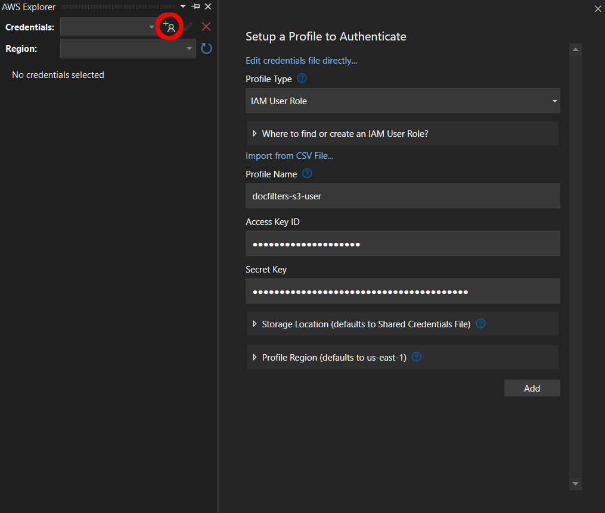

### 9. Testing and Debugging in Visual Studio

In this step, you will compile and debug the sample Lambda function, dynamically connecting to AWS.

 - Ensure the DocFilters.Lambda project is the startup project by right-clicking it and choosing Set as Startup Project.
 - Select <font color ="red">docfilters-s3-user</font> credentials in AWS Explorer.
 - On the toolbar, select Mock Lambda Test Tool as the debug project.
 - Start debugging. New browser card should pop-up.
 - Select <font color="red">*docfilters-s3-user*</font> as *`AWS Credential Profile`*.
 - Enter the following code as a Function Input.

```
{
  "Records": [
    {
      "s3": {
        "bucket": {
          "name": "docfilters-s3-tutorial"
        },
        "object": {
          "key": "benchmark.docx"
        }
      }
    }
  ]
}
```

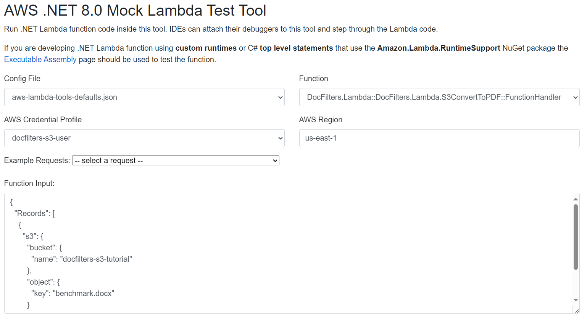

 - Click on Execute Function. Successful conversion should give the following output.
 
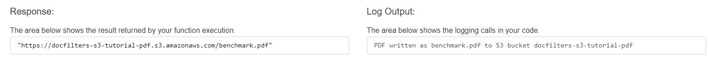

### 10. Deploying Lambda Function to AWS

In this step, you will deploy a Docker image containing the sample Lambda function to the AWS repository.

 - Open Docker application.
 - Right-click on the *`DocFilters.Lambda`* project, and select *`Publish to AWS Lambda…`*.
 - New window will open:
 - Select <font color="red">*docfilters-s3-user*</font> as *`AWS Credentials`*.
 - Select *`image`* as a *`Package Type`*.
 - Select *`Create new function`*.
 - Enter <font color="red">*docfilters-s3-lambda*</font> as function name.
 - Select <font color="red">*docfilters-s3-repository*</font> as *`Image Repo`*.
 - 
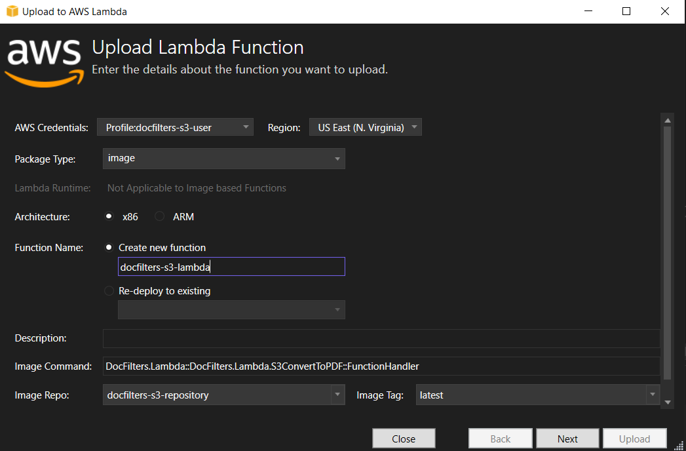

 - Choose *`Next`*.
 - Select <font color="red">*docfilters-s3-role*</font> as *`Role Name`*.
 - Choose *`Upload`*.

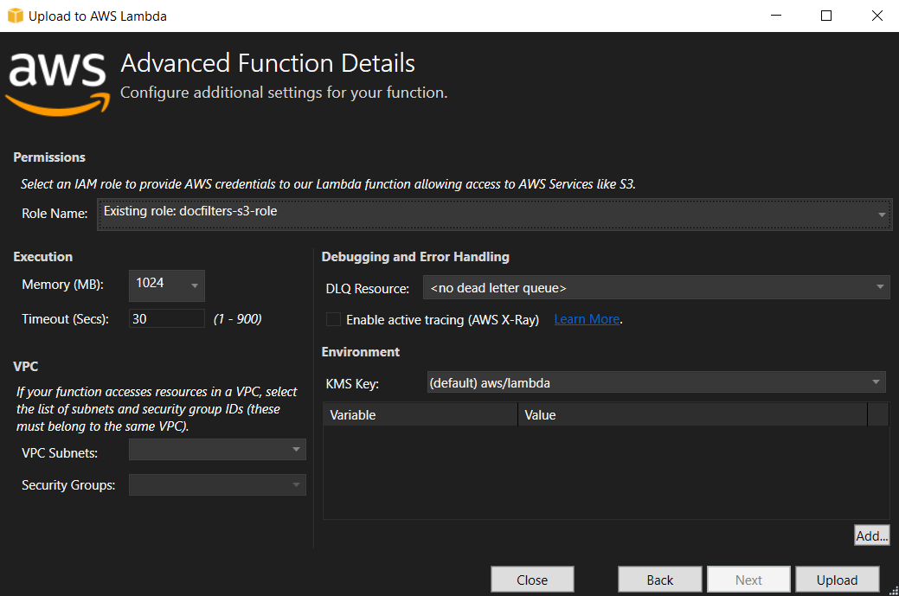

### 11. Set triggers for Lambda function

In this step, you will set triggers for the Lambda function that will activate the conversion every time a new file is uploaded to the <font color="red">docfilters-s3-tutorial</font> bucket.

 - [Open the Amazon Lambda console](https://console.aws.amazon.com/lambda/home).
 - Find the newly updated Lambda function <font color="red">docfilters-s3-lambda</font>. Click on it.
 - Choose *`Add trigger`*.
 
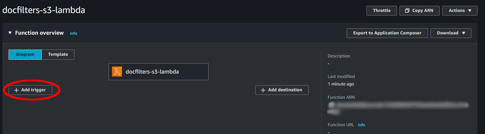

 - Select *`S3`* as a source.  
 - Select <font color="red">*docfilters-s3-tutorial*</font> as a *`Bucket`*.
 - Select *`All object created events`* as *`Event types`*.
 - Enter *`docx`* as *`Suffix`*.
 - Mark the checkbox, that you acknowlege terms of using S3 buckets and Lambda functions, and the risk of possible looping.
 
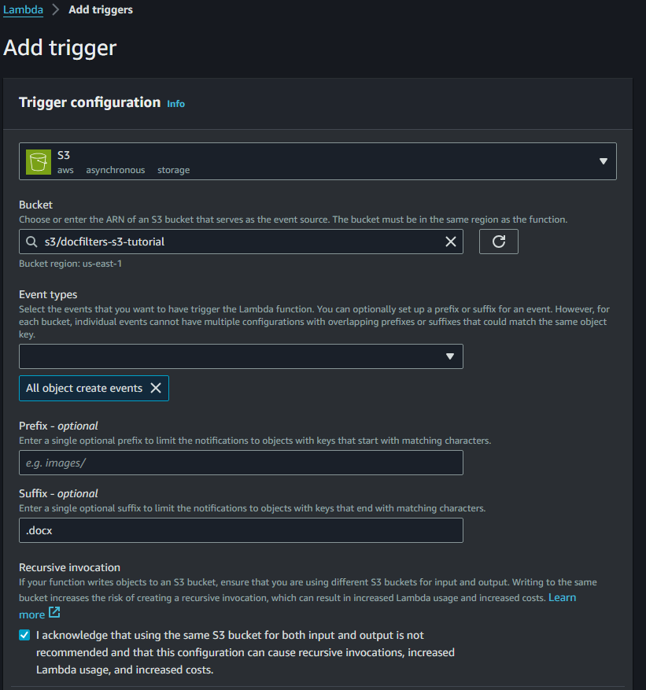

You can now upload a new file to <font color="red">*docfilters-s3-tutorial*</font>, and confirm that the file is automatically converted to a *`*.pdf`* file that is placed in the <font color="red">*docfilters-s3-tutorial-pdf*</font> bucket.